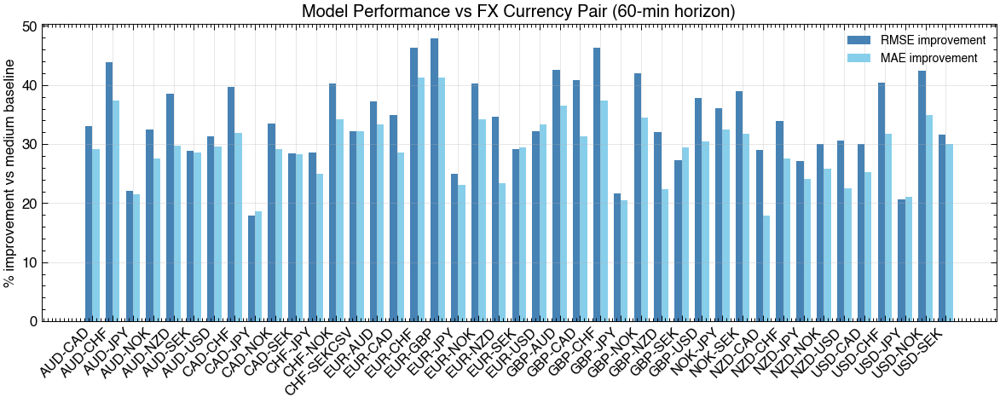
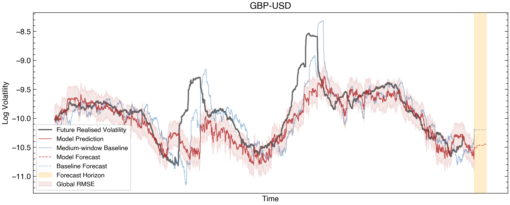
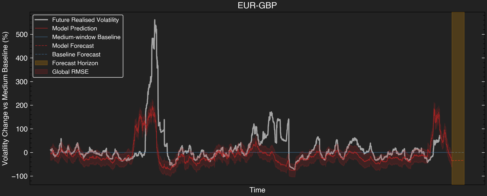

# volare: FX Volatility Forecasting with Machine Learning

This project investigates whether short-horizon **FX spot volatility** contains forecastable structure beyond simple historical volatility estimators (e.g. rolling volatility).

Using high-frequency candle data, it implements a **LightGBM-based volatility forecasting pipeline** with strict chronological validation, explicit baseline comparisons, and careful attention to **regime robustness and interpretability**.

> The goal is **not** to claim tradable “alpha”, but to quantify *when*, *how*, and *by how much* machine-learning forecasts differ from standard rolling-volatility estimates -- and where they fail.

> **Key observation:** The model improves relative error vs rolling-volatility baselines, but gains reduce significantly out-of-sample, indicating partial overfitting alongside genuine structure capture.

---

## Problem & Motivation

Short- to medium-term FX volatility forecasts are central to:

- Risk management and spread setting  
- Liquidity provision and inventory control  
- Volatility-aware execution and trading strategies  

Rather than forecasting prices, this project forecasts **realised volatility**, which is more stable, more interpretable, and more directly relevant for market-making and risk applications.

---

## Validation & Assumptions

- All splits are **strictly chronological**; random cross-validation is avoided due to temporal dependence  
- Early stopping and model constraints are used to **mitigate overfitting** and unstable feedback
- Model performance is benchmarked against **rolling-volatility baselines** (short, medium, long windows)  
- Reported metrics are **relative to baselines**, not absolute error claims  
- Performance varies across horizons, FX pairs, and volatility regimes  
- Short horizons often show **marginal or negative improvements**, particularly during rapid regime changes.

> Explicitly identifying failure modes is a core design goal of this project.

---

## Methodology

1. Compute features and targets from high-frequency candle data  
2. Perform a chronological train/validation/test split  
3. Train a **LightGBM** model on engineered volatility features with early stopping based on validation performance
4. Select the optimal number of boosting iterations using validation data  
5. Retrain on training + validation data with fixed hyperparameters  
6. Compare model forecasts to rolling-volatility baselines  
7. Evaluate using RMSE, MAE, percentage-relative errors, and visual diagnostics  

---

## Workflow

The pipeline is organised into modular components:

- **Data ingestion** (`data.py`)  
- **Feature engineering** (`features.py`):  
  - log returns  
  - rolling volatility  
  - lagged and multi-window volatility  
  - intra-day seasonality  
  - volatility slope, z-score, and acceleration  
- **Model training and evaluation** (`model.py`)  
- **Forecasting utilities** (`predict.py`)  
- **Visualisation and GUI** (`visualisation.py`, `gui/`)  

---

## Features

- Configurable forecast horizons (e.g. 10–60 minutes)  
- Multi-window rolling volatility features  
- Volatility-of-volatility, slope, z-score, and acceleration features  
- Strict chronological validation  
- Model persistence and reuse across FX pairs  
- Interactive GUI for applying trained models to unseen data  

> **Note:** Feature windows are tuned for short horizons (~1 hour). Longer horizons likely require re-tuning or additional slow-moving features.

---

## Results

### Within-Sample Performance

The figures below show **within-sample performance** on training data.  
These results reflect model fit to historical structure and **should not be interpreted as predictive performance**.

**Features used:**  
past rolling volatility, lagged rolling volatility, multi-window volatility, intra-day seasonality, volatility slope, z-score, acceleration.

---

### Predicted vs Actual Volatility with Baseline Comparisons


- The medium-window rolling volatility serves as the reference baseline  
- Model predictions deviate from the baseline when short-term dynamics are informative  

---

### Model Residuals


Residuals highlight regime changes and periods where the model under- or over-reacts relative to the baseline.

---

### Performance vs Baselines


- Percentage improvements refer to RMSE/MAE reduction **relative to the medium-window baseline**
- Improvements vary by horizon and regime and are not guaranteed  

---

### Performance vs Horizon


- Very short horizons often show limited or negative gains  
- Medium horizons show the most consistent deviations from rolling-volatility estimates  
- This motivates fixing the forecast horizon before broader model reuse  

---

## Hyperparameter Tuning (In-Sample)

Before training models on large, multi-pair datasets, **hyperparameters are tuned using in-sample data only**.

This step is deliberately isolated and occurs **prior to any multi-pair training** so that:

- Hyperparameters are **fixed once**  
- No information from later data or other FX pairs leaks into tuning  
- The resulting model can be safely reused on **user-supplied candle data**, including via the interactive GUI  



- Shows **percentage improvement in RMSE and MAE** relative to the medium-window rolling volatility baseline  
- Evaluation is strictly within-sample, highlighting where tuning improves forecasts across FX pairs before any unseen data is introduced

---

## Interactive GUI

The GUI allows applying trained models to unseen CSV data:

- Visualises realised volatility, model predictions, and baseline  
- Displays **percentage deviation from normal (baseline)**  
- Shows global RMSE and MAE on the loaded dataset  
- Supports export of plots and predictions  



> Dark mode 



---

## Limitations

- The model relies on past returns and volatility features only, limiting true predictive signal
- Performance degrades during rapid regime transitions
- Forecasts are conditional on current volatility state persistence
- Improvements are measured relative to simple baselines and may shrink when compared to stronger models (e.g. EWMA, GARCH)

---

## Usage

### Installation

```bash
git clone https://github.com/dominicjtaylor/fx-volatility-forecasting.git
cd fx-volatility-forecasting
pip install -r requirements.txt
pip install -e .
```

### Python

Once the package is installed, you can import it in your Python scripts or interactive sessions:

```python
import volare
from volare import data, features, model

# Load candle data
df = data.load_last_candles("path/to/your/data.csv")

# Compute multi-window rolling volatility
df_features = features.compute_multi_window_rolling_vol(df, horizon_seconds=3600)

# Train/test split
X_train, X_test, y_train, y_test = model.split_data(df_features, feature_cols=[c for c in df_features.columns if 'rolling_vol' in c])

# Train LightGBM
lgb_model, _ = model.train_model(X_train, y_train, X_test, y_test)

# Forecast
preds = lgb_model.predict(X_test)
```

### Interactive GUI

To explore forecasts interactively:

1. Navigate to the `gui` folder:

```bash
cd gui
```

2. Run the GUI script:

```bash
python apply_multi_pair_model.py
```

This allows applying trained models to new CSV data, computing realised volatility, model predictions, and baseline comparisons.
