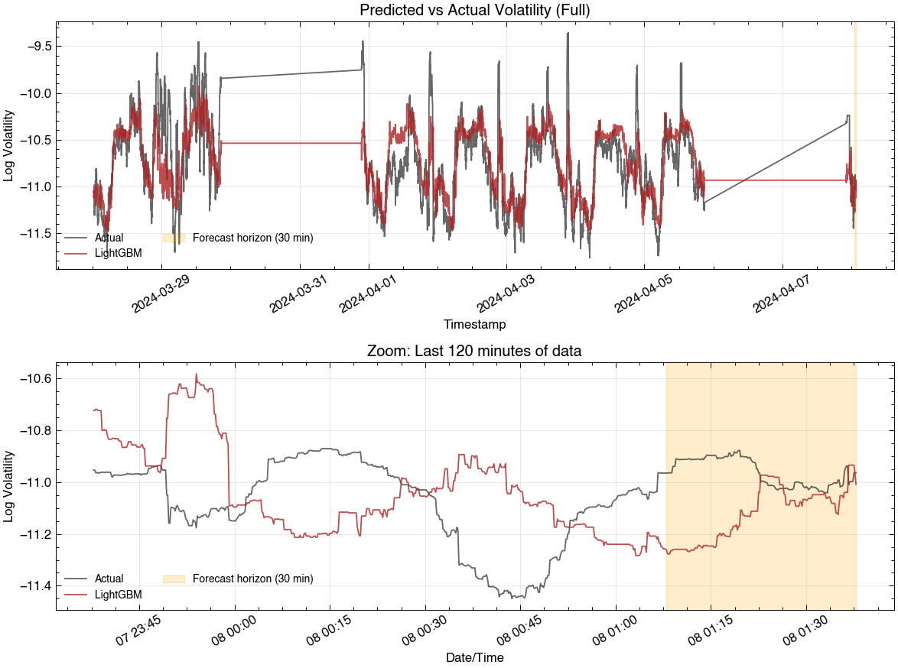
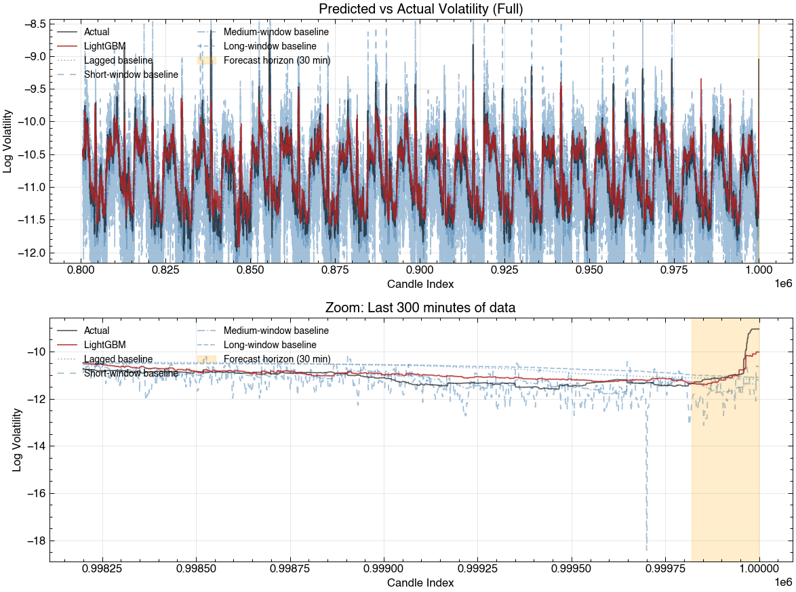
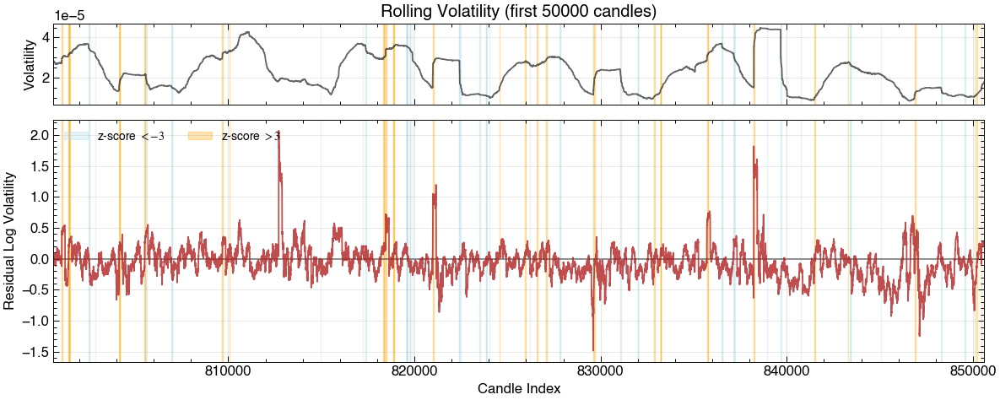
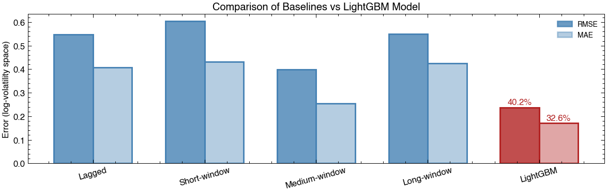
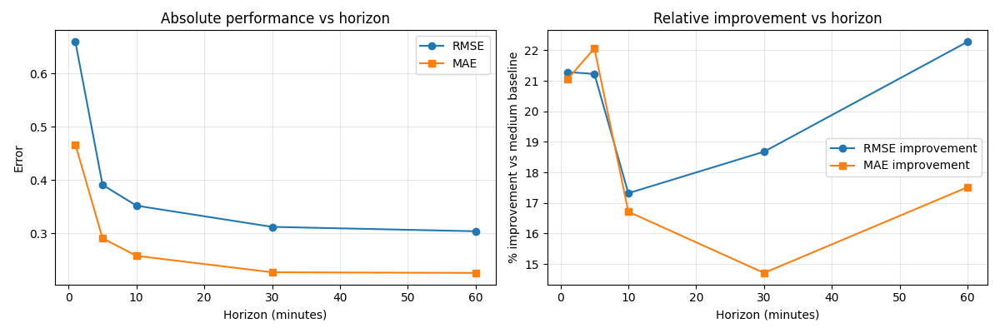

# volare: Tech Finance FX Volatility Forecasting

This project forecasts FX spot volatility using **LightGBM**, a gradient boosting machine learning model, trained on high-frequency candle data in Python.  
It demonstrates a complete workflow of feature engineering, model training, validation, and forecasting, with practical applications for liquidity providers and FX traders.

---

## Workflow

The pipeline consists of:

- **Data ingestion:** import candle data (`data.py`)
- **Feature generation** (`features.py`): log returns, high-low ranges, rolling volatility, rolling future volatility, volatility slope, z-score  
- **Train/test split:** chronological split to respect time dependencies  
- **Model training** (`model.py`): **LightGBM** trained on engineered features with optimised fitting  
- **Model validation** (`model.py`): RMSE, MAE, and visual inspection  
- **Forecasting** (`predict.py`): generate volatility forecasts on new data  
- **Visualisation** (`visualisation.py`): plots and performance metrics  

---

## Features

- Customisable forecast horizons (e.g., 10–30 minutes)  
- Multi-window rolling volatility features  
- Volatility-of-volatility, slope, and acceleration features  
- Chronological train/test split and optional walk-forward validation  
- Model persistence: save and reload **LightGBM** models for downstream use  

---

## Motivation

Short- to medium-term FX volatility forecasts are critical for:  

- Managing risk and setting spreads  
- Optimising liquidity provision  
- Supporting quantitative trading strategies  

By forecasting volatility directly rather than prices, this project highlights actionable insights for trading and risk teams.

---

## Data

This repository does not include raw FX data.

To run the pipeline, users must provide their own historical FX candle data formatted consistently with the training setup used in this project:

- Fixed time-resolution candles (e.g. 10-second)
- Columns in order: `timestamp`, `open`, `high`, `low`, `close`
- Continuous time series without gaps

The trained model and feature pipeline assume this structure. Applying the model to differently formatted data would require retraining or feature redefinition.

---

## Methodology

1. Compute features and target from candle data  
2. Train-test split in chronological order  
3. Train **LightGBM** on features  
4. Compare **LightGBM** model to simple baselines:  
   - **Lagged rolling volatility:** previous backward-looking volatility  
   - **Short-window rolling volatility:** previous backward-looking volatility using a short window
   - **Medium-window rolling volatility:** previous backward-looking volatility using a medium window
   - **Long-window rolling volatility:** previous backward-looking volatility using a long window
5. Evaluate with RMSE, MAE, and visual inspection of predictions  

---

## Results

<!-- | Model | RMSE | MAE |
|-------|------|-----|
| Persistence | 0.0012 | 0.0009 |
| Rolling Vol | 0.0010 | 0.0008 |
| **LightGBM** | **0.0008** | **0.0006** | -->

Visualisations are below and are available in `results/plots/`, for the model trained on a single FX currency pair and **only on the first 800,000 candles** of the time series, with predictions evaluated on an unseen 200,000 candles. The model hyperparameters are yet to be tuned. Features used to train the model include:

- **Past rolling volatility**
- **Lagged rolling volatility**
- **Multi-window rolling volatility**
- **Intra-day seasonality**
- **Volatility slope**
- **Volatility z-score**
- **Volatility acceleration**

<!-- ### Predicted vs Actual Volatility

**Figure:** Predicted vs actual log-volatility.  

*Note:* Results should be interpreted as within-pair temporal generalisation rather than cross-asset performance.

 -->

### Predicted vs Actual Volatility with Baseline Comparisons

**Figure:** Predicted vs actual log-volatility compared to standard baselines.  



### Model Residuals for Regime Handling

**Figure:** Residuals between the data and model (for first 50,000 candles) with rolling volatility for reference, to identify regime handling.



### Statistical Comparison of Baselines and Machine Learning Model

**Figure:** RMSE and MAE of baselines and LightGBM. This model's prediction errors are 33% smaller than using the simple medium-window rolling volatility as a forecast. The model provides predictive signal beyond simple historical smoothing.



### Performance vs Horizon

**Figure:** Performance of the model vs horizon. Left panel shows that the performance degrades with increasing horizon. Right panel shows that the model improves by 22% compared to a medium-window rolling volatility baseline at short horizons, falls at a horizon of 30 mins, and improves again for longer horizons (60 mins).



---

## Usage

Clone the repo and install dependencies:

```bash
git clone https://github.com/dominicjtaylor/fx-volatility-forecasting.git
cd fx-volatility-forecasting
pip install -r requirements.txt

import volare